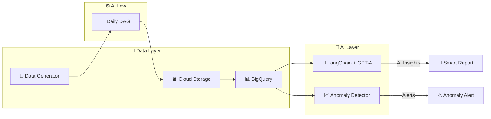

# 🏗️ Intelligent Retail ETL Pipeline

> A production-grade batch ETL pipeline with **AI-powered insights** for daily retail transaction analysis. Combines Apache Airflow orchestration with LangChain + GPT-4 for intelligent reporting.

[](https://airflow.apache.org/)
[](https://cloud.google.com/bigquery)
[](https://langchain.com/)
[](https://openai.com/)
[](https://python.org)
---

## 📊 Architecture



---

## 🤖 AI Features (LangChain + GPT-4)

| Module | Description |
|--------|-------------|
| **LLM Insights** | GPT-4 powered sales analysis with structured output |
| **Anomaly Detection** | Statistical + ML anomaly detection (Z-score, IQR) |
| **Prompt Engineering** | Custom retail analyst persona templates |

### Sample AI Output
```
📊 Daily Sales Intelligence Report

## Executive Summary
Revenue decreased 5.2% compared to yesterday, primarily driven by 
lower T-Shirt sales in the Hamburg store. Sneakers showed strong 
performance (+15%) offsetting some losses.

## 💡 Recommendations
- Run flash sale on T-Shirts to clear inventory
- Increase Sneakers stock before weekend rush
```

---

## 🖥️ Streamlit Dashboard

Run the interactive sales analytics dashboard with AI insights:

```bash
streamlit run app_streamlit.py
```

**Features:**
- 📊 Real-time Sales KPIs (Revenue, Avg Order Value)
- 📈 Interactive visual charts (Daily Trend, Category Split)
- 🤖 **AI Insights Panel** (Powered by GPT-4)
- ⚠️ **Anomaly Detection** Alerts


---

## ⚡ Pipeline Flow

| Step | Task ID | Description |
|------|---------|-------------|
| 1️⃣ | `generate_local_csv` | Generate 1000+ synthetic retail transactions |
| 2️⃣ | `upload_to_gcs` | Upload CSV to GCS bucket with date partitioning |
| 3️⃣ | `load_to_bq_staging` | Load raw data to BigQuery staging table |
| 4️⃣ | `transform_to_fact` | Transform & insert into star-schema fact table |
| 5️⃣ | `ai_analysis` | Generate LLM insights + anomaly detection |
| 6️⃣ | `visualize` | View results in **Streamlit Dashboard** |

---

## 🛠️ Tech Stack

**Data Engineering:**
- Apache Airflow 2.8 (Orchestration)
- Google BigQuery (Data Warehouse)
- Google Cloud Storage (Data Lake)
- Docker + Docker Compose

**AI/ML:**
- LangChain 0.1.9
- OpenAI GPT-4
- Scikit-learn (Anomaly Detection)

---

## 🚀 Quick Start

### Prerequisites
- Docker & Docker Compose installed
- GCP Service Account with BigQuery & GCS permissions

### 1. Clone & Configure
```bash
# Copy environment template
cp .env.example .env

# Add your GCP credentials
mkdir credentials
cp /path/to/your/service-account.json credentials/
```

### 2. Start Airflow
```bash
# Initialize the database
docker-compose up airflow-init

# Start all services
docker-compose up -d
```

### 3. Access Airflow UI
Open [http://localhost:8080](http://localhost:8080)
- **Username**: `admin`
- **Password**: `admin`

### 4. Trigger the DAG
1. Enable the `retail_batch_etl` DAG
2. Click "Trigger DAG" to run manually

---

## 📁 Project Structure

```
ProjectA_Batch_ETL/
├── dags/
│   └── retail_batch_etl.py    # Main Airflow DAG
├── scripts/
│   ├── data_generator.py      # Synthetic data generator
│   └── bigquery_setup.sql     # BigQuery schema definitions
├── ai/                         # 🤖 AI Components
│   ├── llm_insights.py        # LangChain + GPT-4 analysis
│   └── anomaly_detector.py    # Statistical anomaly detection
├── prompts/
│   └── sales_analyst.txt      # Prompt templates
├── logs/                       # Airflow logs
├── plugins/                    # Custom Airflow plugins
├── docker-compose.yml
├── Dockerfile
├── requirements.txt
└── README.md
```

---

## 📊 BigQuery Schema (Star Schema)

### Fact Table: `fact_transactions`
| Column | Type | Description |
|--------|------|-------------|
| `transaction_id` | STRING | Unique transaction ID |
| `store_id` | STRING | Store identifier |
| `product_id` | STRING | Product identifier |
| `category` | STRING | Product category |
| `price` | FLOAT64 | Transaction price |
| `quantity` | INT64 | Quantity sold |
| `transaction_time` | TIMESTAMP | When the sale occurred |
| `insertion_time` | TIMESTAMP | ETL processing time |

**Optimizations**: Partitioned by `transaction_time`, clustered by `category` and `store_id`.

---

## 📈 Sample BI Queries

```sql
-- Daily revenue by category
SELECT 
    DATE(transaction_time) as sale_date,
    category,
    SUM(price * quantity) as total_revenue
FROM `project.retail_analytics.fact_transactions`
GROUP BY 1, 2
ORDER BY 1 DESC, 3 DESC;
```

---

## 🔧 Configuration

Edit the following in `dags/retail_batch_etl.py`:

```python
PROJECT_ID = "your-gcp-project-id"
BUCKET_NAME = "your-gcs-bucket"
DATASET_ID = "retail_analytics"
```

---

## 📄 License

MIT License - Feel free to use for your portfolio!
