# 🏗️ Enterprise Retail ETL Pipeline

> A production-grade batch ETL pipeline for daily retail transaction ingestion into BigQuery, orchestrated with Apache Airflow.

[](https://airflow.apache.org/)
[](https://cloud.google.com/bigquery)
[](https://python.org)

---

## 📊 Architecture

```mermaid
flowchart LR
    subgraph Local["📁 Local Environment"]
        GEN["🔄 Data Generator<br/>(Python + Faker)"]
    end
    
    subgraph Airflow["⚙️ Apache Airflow"]
        DAG["📅 Daily DAG<br/>(retail_batch_etl)"]
    end
    
    subgraph GCP["☁️ Google Cloud Platform"]
        GCS["🪣 Cloud Storage<br/>(Raw Data Lake)"]
        STG["📋 Staging Table<br/>(stg_sales)"]
        FACT["⭐ Fact Table<br/>(fact_transactions)"]
        VIEW["📈 BI Views<br/>(daily_revenue)"]
    end
    
    GEN --> DAG
    DAG -->|Upload CSV| GCS
    GCS -->|Load| STG
    STG -->|Transform| FACT
    FACT --> VIEW
```



---

## ⚡ Pipeline Flow

| Step | Task ID | Description |
|------|---------|-------------|
| 1️⃣ | `generate_local_csv` | Generate 1000+ synthetic retail transactions |
| 2️⃣ | `upload_to_gcs` | Upload CSV to GCS bucket with date partitioning |
| 3️⃣ | `load_to_bq_staging` | Load raw data to BigQuery staging table |
| 4️⃣ | `transform_to_fact` | Transform & insert into star-schema fact table |

---

## 🛠️ Tech Stack

- **Orchestration**: Apache Airflow 2.8
- **Data Warehouse**: Google BigQuery
- **Data Lake**: Google Cloud Storage
- **Containerization**: Docker + Docker Compose
- **Language**: Python 3.11

---

## 🚀 Quick Start

### Prerequisites
- Docker & Docker Compose installed
- GCP Service Account with BigQuery & GCS permissions

### 1. Clone & Configure
```bash
# Copy environment template
cp .env.example .env

# Add your GCP credentials
mkdir credentials
cp /path/to/your/service-account.json credentials/
```

### 2. Start Airflow
```bash
# Initialize the database
docker-compose up airflow-init

# Start all services
docker-compose up -d
```

### 3. Access Airflow UI
Open [http://localhost:8080](http://localhost:8080)
- **Username**: `admin`
- **Password**: `admin`

### 4. Trigger the DAG
1. Enable the `retail_batch_etl` DAG
2. Click "Trigger DAG" to run manually

---

## 📁 Project Structure

```
ProjectA_Batch_ETL/
├── dags/
│   └── retail_batch_etl.py    # Main Airflow DAG
├── scripts/
│   ├── data_generator.py      # Synthetic data generator
│   └── bigquery_setup.sql     # BigQuery schema definitions
├── logs/                       # Airflow logs
├── plugins/                    # Custom Airflow plugins
├── credentials/                # GCP service account (git-ignored)
├── docker-compose.yml
├── Dockerfile
├── requirements.txt
└── README.md
```

---

## 📊 BigQuery Schema (Star Schema)

### Fact Table: `fact_transactions`
| Column | Type | Description |
|--------|------|-------------|
| `transaction_id` | STRING | Unique transaction ID |
| `store_id` | STRING | Store identifier |
| `product_id` | STRING | Product identifier |
| `category` | STRING | Product category |
| `price` | FLOAT64 | Transaction price |
| `quantity` | INT64 | Quantity sold |
| `transaction_time` | TIMESTAMP | When the sale occurred |
| `insertion_time` | TIMESTAMP | ETL processing time |

**Optimizations**: Partitioned by `transaction_time`, clustered by `category` and `store_id`.

---

## 📈 Sample BI Queries

```sql
-- Daily revenue by category
SELECT 
    DATE(transaction_time) as sale_date,
    category,
    SUM(price * quantity) as total_revenue
FROM `project.retail_analytics.fact_transactions`
GROUP BY 1, 2
ORDER BY 1 DESC, 3 DESC;
```

---

## 🔧 Configuration

Edit the following in `dags/retail_batch_etl.py`:

```python
PROJECT_ID = "your-gcp-project-id"
BUCKET_NAME = "your-gcs-bucket"
DATASET_ID = "retail_analytics"
```

---

## 📄 License

MIT License - Feel free to use for your portfolio!
